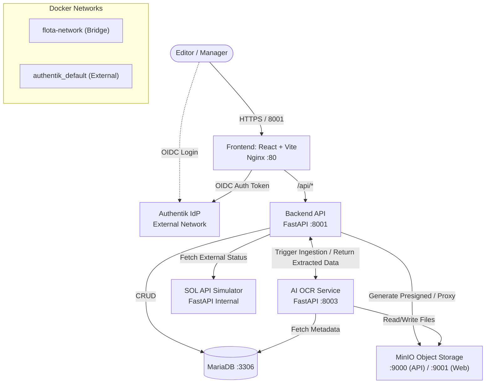

# Flota Documents Management System

This repository contains an enterprise-grade fleet document management system. It leverages a microservices architecture to automate the ingestion, classification, and data extraction of vehicle-related documents (insurance policies, circulation cards, invoices, etc.) using AI-powered Optical Character Recognition (OCR) backed by Large Language Models (LLMs). 

The platform also provides a "Human-In-The-Loop" (HITL) interface, enabling fleet managers to verify the AI's extractions against the source files in a secure, performant dashboard.


## System Architecture


The application is fully containerized and orchestrated via Docker Compose. Below is a detailed view of the infrastructure, the modules, and how they communicate.



### Module Breakdown

1. **Frontend (`/frontend`)**: Served via Nginx on port `8001`. A React Single Page Application (SPA) utilizing Vite, TailwindCSS, and React Query. It intercepts API calls to the backend and AI services and handles Authentik login redirects.
2. **Backend API (`/backend`)**: A FastAPI application running internally on port `8001` (exposed via the frontend proxy). Acts as the central orchestrator, managing relational data in MariaDB via SQLAlchemy and generating short-lived JWT tokens to securely proxy MinIO files to the browser.
3. **AI OCR Service (`/ai`)**: A separate FastAPI instance running on port `8003`. Receives binary file uploads, utilizes LangChain/LangGraph and Gemini models to classify and extract structured data, streams Server-Sent Events (SSE) back to the UI, and persists the final payload to the Backend.
4. **SOL API Simulator (`/sol_api_sim`)**: A mock microservice mimicking an external ERP/Logistics provider. It hot-reloads data from an Excel spreadsheet into a Pandas DataFrame and exposes it via REST endpoints.
5. **Database (`/db`)**: MariaDB container mapping `mariadb_data` for persistence.
6. **Object Storage (`/minio`)**: MinIO handling all S3-compatible file storage. Port `9000` is used for the S3 API and `9001` for the administrative console.

## Authentication & Security

We use **Authentik** as the Identity Provider (IdP) for OIDC (OpenID Connect). 
- The frontend initiates an authorization code flow with Authentik.
- Upon success, the frontend receives a JWT Access Token.
- All requests to the Backend and AI endpoints require this Bearer token in the `Authorization` header.
- The Backend validates this token (`auth.py`) against the Authentik Discovery URL (`OIDC_DISCOVERY_URL`) and enforces Role-Based Access Control (RBAC), verifying if the user has `editor` privileges before allowing write operations.

## Quick Start

1. Duplicate `.env.example` to `.env` and configure your credentials (MySQL, MinIO, Gemini, Authentik).
2. Ensure you have the external `authentik_default` network running (or adjust your `docker-compose.yml` if Authentik is deployed differently).
3. Start the cluster:
   ```bash
   docker compose up -d --build
   ```
4. Access the dashboard at [http://localhost:8001](http://localhost:8001).
