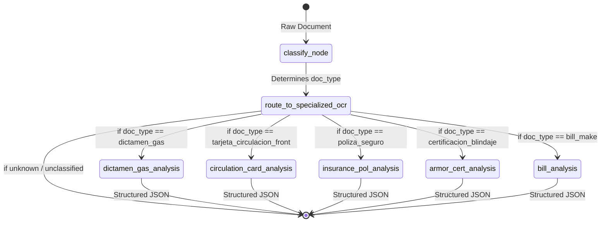

# AI OCR Ingestion Service

This microservice acts as the intelligent document processing engine for the Flota management system. It exposes a FastAPI endpoint that handles parallel file uploads, orchestrates Large Language Models (LLMs) via LangGraph, and streams execution progress to the client using Server-Sent Events (SSE).

## LangGraph Orchestration Flow

We use LangGraph to build a deterministic, stateful workflow for processing incoming documents. The workflow utilizes a single router node that classifies the document and then conditionally routes the execution to specialized extraction nodes.



## Core Components

- **`SingleFileAgent`**: The main class wrapping the LangGraph state machine. It manages a `SingleFileState` dictionary.
- **Classification Node**: Uses Gemini to analyze the first page of a document and classify it into one of the allowed `doc_type` enums.
- **Analysis Nodes**: Highly specialized prompt templates and LLM chains optimized for extracting precise key-value pairs (e.g., VIN, license plates, expiration dates) based on the classified document type.

### Extracted Data by Document Type

The AI uses strict Pydantic schemas to ensure structured, consistent JSON output. In addition to the fields listed below, every extraction returns a `confidence_score` (0-100) and `extraction_notes` (for OCR warnings/anomalies):

| Document Type | Internal ID | Extracted Fields |
| :--- | :--- | :--- |
| **Dictamen de Gas** | `dictamen_gas` | `issue_date`, `location` (verification center), `serial_number` (NIV/VIN), `approved` (boolean) |
| **Tarjeta de Circulación** | `tarjeta_circulacion_front` | `name` (owner), `issue_date`, `is_permanent` (boolean), `expiration_date`, `niv` (VIN), `folio`, `placa`, `use` (particular/federal), `federal_entity` (state) |
| **Póliza de Seguro** | `poliza_seguro` | `issue_date`, `expiration_date`, `insurance_company`, `policy` (number), `paragraph` (inciso) |
| **Certificación de Blindaje** | `certificacion_blindaje` | `issue_date`, `armoring_company`, `armor_level`, `folio`, `metal_plate_number`, `vehicle_info` (`make`, `type`, `model`, `niv`) |
| **Carta Factura** | `bill_make` | `issue_date`, `uuid` (fiscal), `client_name`, `vehicle_info` (`make`, `version`, `model`, `niv`, `motor_serial_numer`, `number_cylinders`, `vehicle_id`) |

## Parallel Processing & SSE

The endpoint `/ai/{vehicle_id}` accepts a list of `UploadFile`. It leverages `asyncio.Queue` and concurrent workers to process multiple files in parallel. 
- As each node in the LangGraph finishes, an event is yielded to the queue.
- These events are pushed to the frontend in real-time as an SSE stream (`text/event-stream`), providing a responsive UX without blocking HTTP requests.
- Upon successful LLM extraction, the service uploads the raw file to MinIO and sends an internal POST request to the Backend API to persist the extracted payload.

## Development & Tracing

This project uses `uv` for lightning-fast dependency management and supports **LangSmith** for full observability of LLM chains.

```bash
uv sync
fastapi dev main.py
```

To enable tracing, ensure `LANGSMITH_API_KEY` and `LANGCHAIN_TRACING_V2=true` are set in your `.env`.
